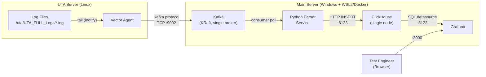
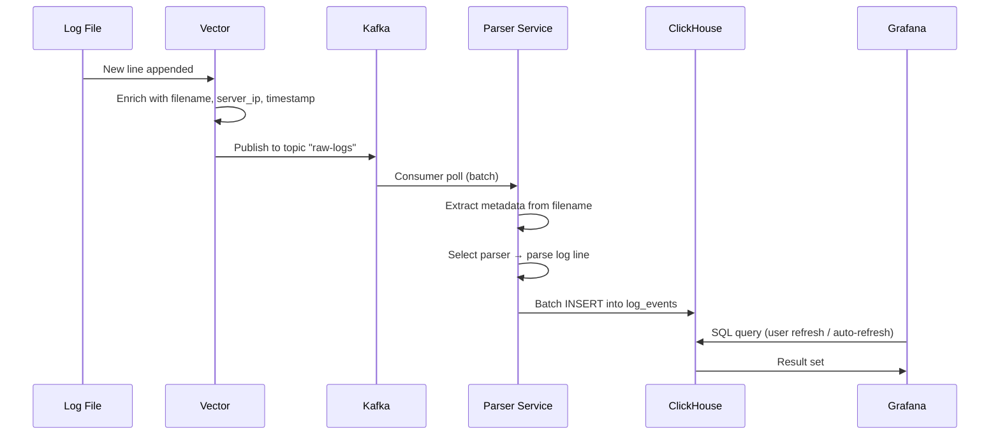
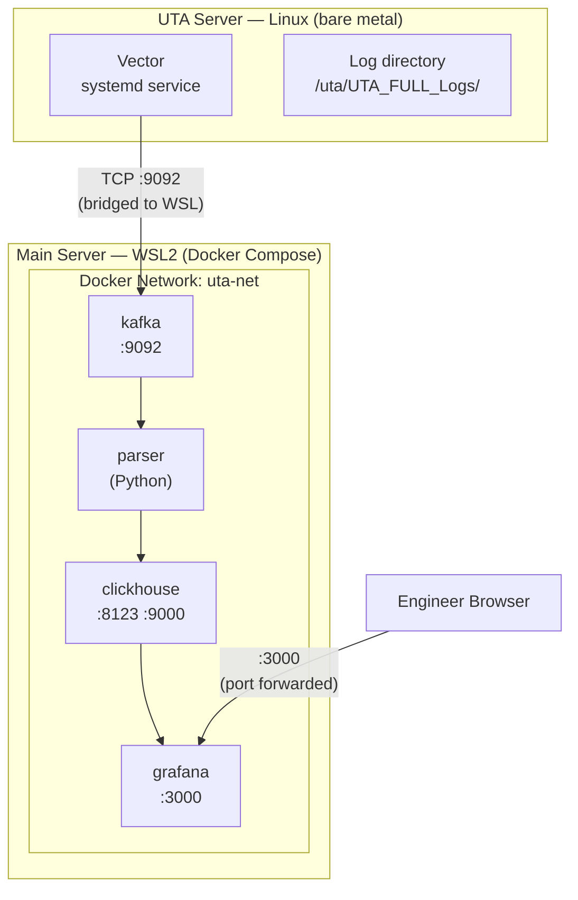

# POC — Architecture

## System Context



## Data Flow



## Deployment Topology



## Kafka Topic Design (POC)

| Topic | Partitions | Retention | Key | Value |
|-------|-----------|-----------|-----|-------|
| `raw-logs` | 1 | 24h | `server_ip:slot_id` | JSON (see below) |

### Message Schema (`raw-logs` value)
```json
{
  "server_ip": "192.168.1.10",
  "log_filename": "R7S4-12_20260414_163815_EXEC_AA2_SIRIUS_UFS_3_1_V8_TLC_1Tb_SAMSUNG_512GB_P00_RC16_FW04_Rack7_Sai_Revathi_Qual_UFS.log",
  "line": "16:38:20 [INFO] Test TC_001 started — sequential read 128K",
  "line_number": 42,
  "timestamp": "2026-04-14T16:38:20.000Z"
}
```

## Component Responsibilities

| Component | Input | Output | Failure Mode |
|-----------|-------|--------|-------------|
| **Vector** | File changes (inotify) | Kafka messages | Resumes from checkpoint on restart |
| **Kafka** | Messages from Vector | Consumer-readable log | Durable on disk (24h retention) |
| **Parser** | Kafka messages (batch) | ClickHouse rows | Commits offset only after CH write succeeds |
| **ClickHouse** | HTTP INSERT batches | Queryable tables | Data persisted in MergeTree |
| **Grafana** | SQL queries to CH | Dashboards | Stateless, reads only |

## Network Ports

| Port | Service | Protocol | Exposed To |
|------|---------|----------|-----------|
| 9092 | Kafka | TCP | UTA server (Vector), Parser container |
| 8123 | ClickHouse HTTP | TCP | Parser container, Grafana container |
| 9000 | ClickHouse Native | TCP | Internal only |
| 3000 | Grafana | HTTP | Engineer browser (Windows host) |
