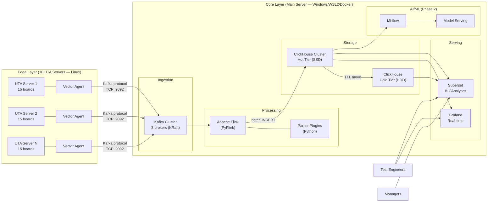
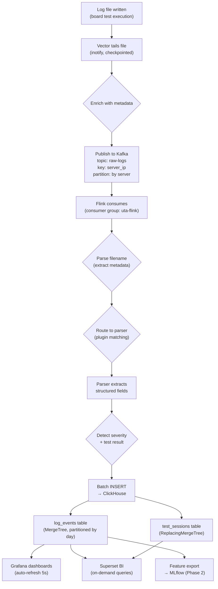
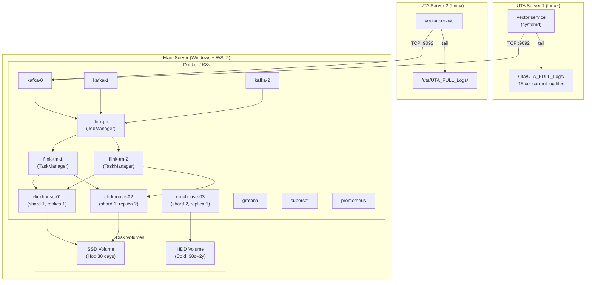
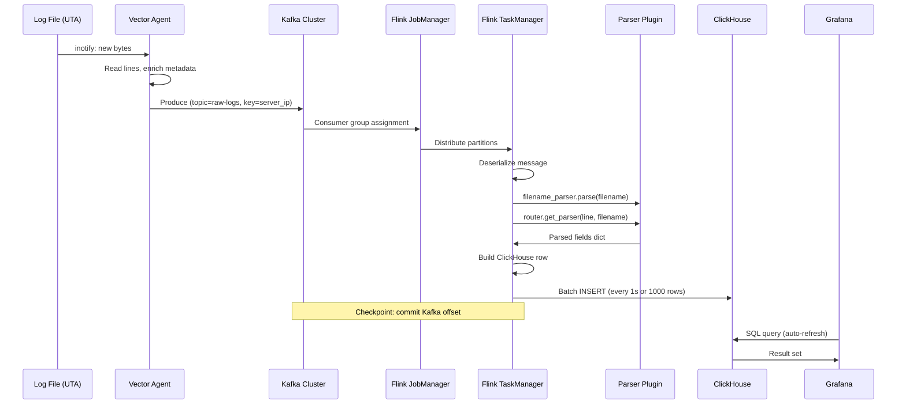

# SYSTEM — Architecture

## 1. System Context Diagram

## 2. Data Flow Diagram

## 3. Deployment Diagram

## 4. Component Interaction

## 5. Kafka Topic Architecture

| Topic | Partitions | Key | Replication | Retention | Purpose |
|-------|-----------|-----|-------------|-----------|---------|
| `raw-logs` | 10 (one per server) | `server_ip` | 3 | 24h | Raw log lines from Vector |
| `parsed-events` (optional) | 10 | `server_ip` | 3 | 12h | Parsed output from Flink (for debugging / alternative consumers) |
| `dead-letter` | 1 | — | 3 | 7d | Messages that failed parsing |

## 6. Failure Handling

| Failure | Detection | Recovery |
|---------|-----------|----------|
| Vector agent crash | systemd auto-restart | Resumes from file checkpoint |
| Network loss (UTA → Kafka) | Vector internal buffer (disk-backed) | Drains buffer when network restored |
| Kafka broker failure | KRaft consensus (2/3 majority) | Automatic leader election |
| Flink TaskManager crash | Flink restarts task | Resumes from last Kafka checkpoint |
| ClickHouse node failure | Replica takes over reads | Automatic replication catch-up |
| Grafana crash | Stateless, Docker restart | Instant recovery |
