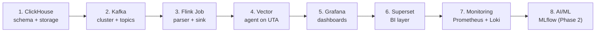
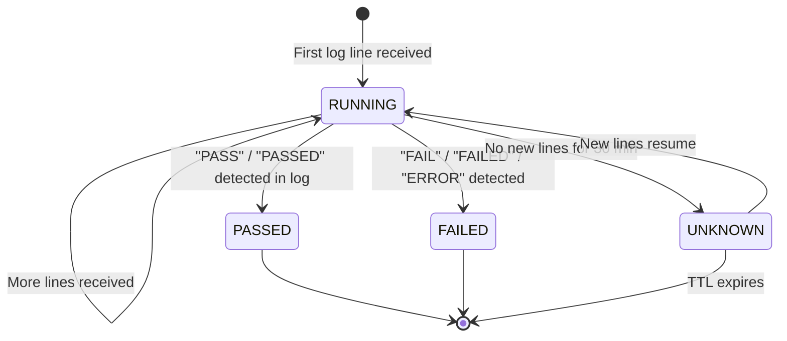

# SYSTEM — Technical Implementation

## 1. Build Order



---

## 2. Flink Job Topology

File: `services/flink-job/src/job.py`

```python
"""
Flink streaming job: Kafka → Parse → ClickHouse
"""
from pyflink.datastream import StreamExecutionEnvironment
from pyflink.datastream.connectors.kafka import (
    KafkaSource, KafkaOffsetsInitializer
)
from pyflink.common.serialization import SimpleStringSchema
from pyflink.common import WatermarkStrategy
from pyflink.datastream import RuntimeExecutionMode

import json
from router import process_message
from clickhouse_sink import ClickHouseSink


def build_job():
    env = StreamExecutionEnvironment.get_execution_environment()
    env.set_runtime_mode(RuntimeExecutionMode.STREAMING)
    env.set_parallelism(4)  # Match Kafka partitions

    # Checkpointing: every 10 seconds
    env.enable_checkpointing(10_000)
    env.get_checkpoint_config().set_min_pause_between_checkpoints(5_000)

    # Kafka Source
    kafka_source = (
        KafkaSource.builder()
        .set_bootstrap_servers("kafka-0:9092,kafka-1:9092,kafka-2:9092")
        .set_topics("raw-logs")
        .set_group_id("uta-flink")
        .set_starting_offsets(KafkaOffsetsInitializer.latest())
        .set_value_only_deserializer(SimpleStringSchema())
        .build()
    )

    # Pipeline
    stream = env.from_source(
        kafka_source,
        WatermarkStrategy.no_watermarks(),
        "kafka-raw-logs"
    )

    parsed = stream.map(
        lambda raw: process_message(json.loads(raw)),
        output_type=None  # dict
    ).name("parse-log-lines")

    # Sink to ClickHouse (custom)
    parsed.add_sink(
        ClickHouseSink(
            host="clickhouse-01",
            port=8123,
            database="uta",
            table="log_events",
            batch_size=1000,
            flush_interval_ms=1000,
        )
    ).name("clickhouse-sink")

    env.execute("uta-log-analytics")


if __name__ == "__main__":
    build_job()
```

## 3. ClickHouse Sink (Custom Flink Sink)

File: `services/flink-job/src/clickhouse_sink.py`

```python
"""
Custom Flink sink that batches rows and inserts into ClickHouse.
"""
import time
import threading
import clickhouse_connect
from pyflink.datastream import SinkFunction


class ClickHouseSink(SinkFunction):
    def __init__(self, host, port, database, table, batch_size=1000, flush_interval_ms=1000):
        self._host = host
        self._port = port
        self._database = database
        self._table = table
        self._batch_size = batch_size
        self._flush_interval = flush_interval_ms / 1000.0
        self._buffer = []
        self._client = None
        self._lock = threading.Lock()
        self._columns = [
            "server_ip", "slot_id", "log_filename", "line_number",
            "raw_line", "parsed", "parser_id", "severity",
            "test_case", "test_result", "log_timestamp",
            "platform", "firmware_version", "execution_type",
            "project", "interface_version", "manufacturer",
        ]

    def open(self, runtime_context):
        self._client = clickhouse_connect.get_client(
            host=self._host, port=self._port, database=self._database
        )
        # Start periodic flush thread
        self._running = True
        self._flush_thread = threading.Thread(target=self._periodic_flush, daemon=True)
        self._flush_thread.start()

    def invoke(self, value, context):
        with self._lock:
            row = [value.get(c) for c in self._columns]
            self._buffer.append(row)
            if len(self._buffer) >= self._batch_size:
                self._flush()

    def _flush(self):
        if not self._buffer:
            return
        batch = self._buffer
        self._buffer = []
        self._client.insert(self._table, batch, column_names=self._columns)

    def _periodic_flush(self):
        while self._running:
            time.sleep(self._flush_interval)
            with self._lock:
                self._flush()

    def close(self):
        self._running = False
        with self._lock:
            self._flush()
        if self._client:
            self._client.close()
```

## 4. Vector Configuration (Multi-Server)

Template: `services/vector-agent/vector.toml.j2` (Ansible Jinja2)

```toml
data_dir = "/var/lib/vector"

[sources.uta_logs]
type = "file"
include = ["/uta/UTA_FULL_Logs/*.log"]
read_from = "end"
fingerprint.strategy = "device_and_inode"
max_line_bytes = 102400
line_delimiter = "\n"

[sources.uta_backup_logs]
type = "file"
include = ["/uta/UTA_LOGS_BACKUP/**/*.log"]
read_from = "beginning"
fingerprint.strategy = "device_and_inode"
max_line_bytes = 102400
ignore_older_secs = 86400  # Only process backup files < 24h old

[transforms.enrich]
type = "remap"
inputs = ["uta_logs", "uta_backup_logs"]
source = '''
  .server_ip = "{{ server_ip }}"
  .log_filename = replace(strip_ansi_escape_codes(get!(., path: ["file"])), r'/uta/UTA_FULL_Logs/', "")
  .log_filename = replace(.log_filename, r'/uta/UTA_LOGS_BACKUP/[^/]+/', "")
  .line = .message
  del(.message)
  del(.source_type)
  .line_number = to_int(.offset) ?? 0
'''

[sinks.kafka_out]
type = "kafka"
inputs = ["enrich"]
bootstrap_servers = "{{ kafka_bootstrap_servers }}"
topic = "raw-logs"
encoding.codec = "json"
key_field = "server_ip"
compression = "lz4"
batch.max_bytes = 1048576
batch.timeout_secs = 1
buffer.type = "disk"
buffer.max_size = 268435456  # 256MB disk buffer for network outages
```

## 5. Kafka Cluster Setup

3-broker KRaft cluster. Docker Compose (production would use dedicated VMs or K8s).

```yaml
# Relevant docker-compose.prod.yml snippet
services:
  kafka-0:
    image: apache/kafka:latest
    environment:
      KAFKA_NODE_ID: 0
      KAFKA_PROCESS_ROLES: broker,controller
      KAFKA_LISTENERS: PLAINTEXT://0.0.0.0:9092,CONTROLLER://0.0.0.0:9093
      KAFKA_ADVERTISED_LISTENERS: PLAINTEXT://${MAIN_SERVER_IP}:9092
      KAFKA_CONTROLLER_QUORUM_VOTERS: 0@kafka-0:9093,1@kafka-1:9093,2@kafka-2:9093
      KAFKA_CONTROLLER_LISTENER_NAMES: CONTROLLER
      KAFKA_LISTENER_SECURITY_PROTOCOL_MAP: PLAINTEXT:PLAINTEXT,CONTROLLER:PLAINTEXT
      KAFKA_NUM_PARTITIONS: 10
      KAFKA_DEFAULT_REPLICATION_FACTOR: 3
      KAFKA_MIN_INSYNC_REPLICAS: 2
      KAFKA_LOG_RETENTION_HOURS: 24
      CLUSTER_ID: "uta-prod-cluster"
    volumes:
      - kafka-0-data:/var/lib/kafka/data

  kafka-1:
    image: apache/kafka:latest
    environment:
      KAFKA_NODE_ID: 1
      # ... same as above with NODE_ID=1, different port mappings
    volumes:
      - kafka-1-data:/var/lib/kafka/data

  kafka-2:
    image: apache/kafka:latest
    environment:
      KAFKA_NODE_ID: 2
      # ... same as above with NODE_ID=2
    volumes:
      - kafka-2-data:/var/lib/kafka/data
```

## 6. Flink Cluster Setup

```yaml
# docker-compose.prod.yml snippet
services:
  flink-jobmanager:
    image: flink:latest
    command: jobmanager
    environment:
      FLINK_PROPERTIES: |
        jobmanager.rpc.address: flink-jobmanager
        state.checkpoints.dir: file:///opt/flink/checkpoints
        state.savepoints.dir: file:///opt/flink/savepoints
    volumes:
      - flink-checkpoints:/opt/flink/checkpoints

  flink-taskmanager:
    image: flink:latest
    command: taskmanager
    environment:
      FLINK_PROPERTIES: |
        jobmanager.rpc.address: flink-jobmanager
        taskmanager.numberOfTaskSlots: 4
        taskmanager.memory.process.size: 4096m
    deploy:
      replicas: 2
    depends_on:
      - flink-jobmanager
```

## 7. Test Session Lifecycle



The parser updates `test_sessions.status` based on test result keywords detected in log lines. A background ClickHouse materialized view or scheduled query marks stale sessions (no new lines for 30 min) as `UNKNOWN`.

## 8. Ansible Deployment (Vector to UTA Servers)

```yaml
# infra/ansible/playbooks/deploy-vector.yml
---
- name: Deploy Vector to UTA Servers
  hosts: uta_servers
  become: yes
  vars:
    kafka_bootstrap_servers: "{{ main_server_ip }}:9092"
  tasks:
    - name: Install Vector
      shell: curl --proto '=https' --tlsv1.2 -sSfL https://sh.vector.dev | bash
      args:
        creates: /usr/bin/vector

    - name: Deploy Vector config
      template:
        src: ../roles/vector/templates/vector.toml.j2
        dest: /etc/vector/vector.toml
      notify: Restart Vector

    - name: Set environment variables
      copy:
        content: |
          VECTOR_SERVER_IP={{ ansible_default_ipv4.address }}
        dest: /etc/default/vector

    - name: Enable and start Vector
      systemd:
        name: vector
        enabled: yes
        state: started

  handlers:
    - name: Restart Vector
      systemd:
        name: vector
        state: restarted
```

Inventory: `infra/ansible/inventory.yml`
```yaml
all:
  vars:
    main_server_ip: 192.168.1.100
  children:
    uta_servers:
      hosts:
        uta-server-01:
          ansible_host: 192.168.1.10
        uta-server-02:
          ansible_host: 192.168.1.11
        # ... add more
```
