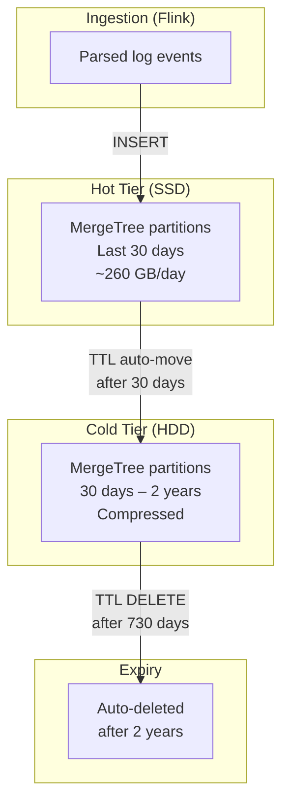

# SYSTEM — Storage Strategy

## 1. Tiered Storage Architecture



## 2. ClickHouse Storage Policy

### Disk Configuration

```xml
<!-- services/clickhouse/config/config.xml -->
<clickhouse>
    <storage_configuration>
        <disks>
            <hot>
                <path>/var/lib/clickhouse/hot/</path>
                <!-- Mount: SSD/NVMe volume -->
            </hot>
            <cold>
                <path>/var/lib/clickhouse/cold/</path>
                <!-- Mount: HDD/NAS volume -->
            </cold>
        </disks>
        <policies>
            <hot_cold>
                <volumes>
                    <hot>
                        <disk>hot</disk>
                    </hot>
                    <cold>
                        <disk>cold</disk>
                    </cold>
                </volumes>
                <!-- Move to cold when hot is 90% full -->
                <move_factor>0.1</move_factor>
            </hot_cold>
        </policies>
    </storage_configuration>
</clickhouse>
```

### TTL Rules on Tables

```sql
-- Applied in table DDL (see 05-data-model.md)
ALTER TABLE uta.log_events
    MODIFY TTL
        ingested_at + INTERVAL 30 DAY TO VOLUME 'cold',
        ingested_at + INTERVAL 730 DAY DELETE;
```

## 3. Capacity Planning

### Storage Growth

| Metric | Daily | 30-Day (Hot) | 1 Year | 2 Year |
|--------|-------|-------------|--------|--------|
| Raw ingested | ~2.6 TB | ~78 TB | ~949 TB | ~1.9 PB |
| After ClickHouse compression (~10:1) | ~260 GB | ~7.8 TB | ~95 TB | ~190 TB |
| With cold compression (~15:1 older data) | — | — | ~63 TB | ~127 TB |

### Recommended Disk Sizes

| Tier | Disk Size | Type | Contents |
|------|-----------|------|----------|
| Hot | 8–10 TB | NVMe SSD | Last 30 days of data + materialized views |
| Cold | 100+ TB | HDD / NAS | 30 days to 2 years of historical data |

## 4. Compression Settings

```sql
-- Column-level codec optimization for log_events
ALTER TABLE uta.log_events
    MODIFY COLUMN raw_line     String CODEC(ZSTD(3)),   -- High compression for large text
    MODIFY COLUMN parsed       Map(String, String) CODEC(LZ4),  -- Fast for frequent reads
    MODIFY COLUMN server_ip    LowCardinality(String) CODEC(LZ4),
    MODIFY COLUMN platform     LowCardinality(String) CODEC(LZ4);
```

| Column | Codec | Rationale |
|--------|-------|-----------|
| `raw_line` | ZSTD(3) | Large text, rarely queried individually, high compression |
| `parsed` | LZ4 | Structured data, frequently queried, balance speed/size |
| `severity` | Enum8 (implicit) | Already compact (1 byte) |
| Low-cardinality strings | LowCardinality + LZ4 | Dictionary encoding + fast decompression |

## 5. Partition Management

- **Partition key**: `toYYYYMMDD(ingested_at)` — one partition per day.
- **Partition count**: ~730 partitions at 2-year retention.
- **Merge strategy**: Default ClickHouse part merging.

```sql
-- Query to monitor partition sizes
SELECT
    partition,
    formatReadableSize(sum(bytes_on_disk)) AS disk_size,
    sum(rows) AS row_count,
    count() AS part_count
FROM system.parts
WHERE table = 'log_events' AND active
GROUP BY partition
ORDER BY partition DESC
LIMIT 30;
```

## 6. Backup Strategy

| What | Method | Frequency |
|------|--------|-----------|
| ClickHouse hot data | `clickhouse-backup` to NAS | Daily |
| ClickHouse cold data | Already on durable HDD; no extra backup | — |
| Kafka topics | Built-in retention (24h); not backed up | — |
| Grafana dashboards | JSON provisioning files in Git | On change |
| Flink checkpoints | Local volume; ephemeral (recreatable) | — |
